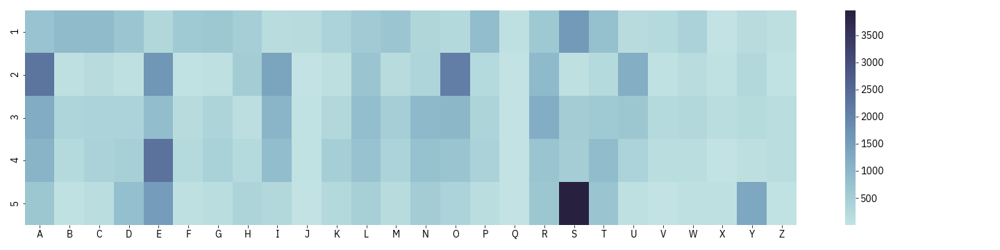

# wordle-analysis

Analyzing the most strategic words to guess on Wordle, based on letter frequency distributions

## The Data

`12972` [guessable words](./word_list_data/guessable_words.csv)  
`2315` [mystery words](./word_list_data/mystery_words.csv)

## Exploratory Analysis

### Mystery Word Heatmap

### Guessable Word Heatmap

