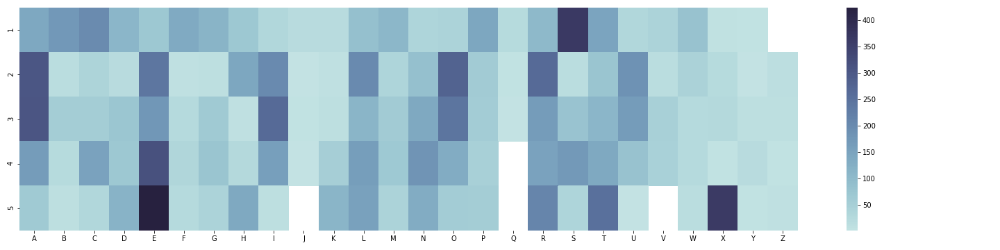

# wordle-analysis

Analyzing the most strategic words to guess on Wordle, based on letter frequency distributions

## The Data

`12972` [guessable words](./word_list_data/guessable_words.csv)  
`2315` [mystery words](./word_list_data/mystery_words.csv)\*

_\* = These words comprise a word bank that is hard-coded into the  
Wordle source code and used to randomly pick the daily puzzle each day_

## Exploratory Analysis

#### Most common letters

In the words of Pat Sajak, "R, S, T, L, N, E". These are the most frequently appearing letters in the English language and are, as such, used in the Bonus Round of the game Wheel of Fortune. But I wanted to start this project by verifying if they are, in fact, the most frequent letters when we limit our scope to only _5-letter_ English words.

As it turns out, `E`, `A`, `R`, `O`, `T`, `L`, `I`, `S` are the most frequent letters that appear in 5-letter words. Now, quick, think of a 5-letter word using these letters!

#### Heatmap to analyze letter frequency by positions

## Simple Scoring Heuristics

Suppose today's Wordle solution is `CRIMP`.

Guess 1: `RAISE` => 🟨⬛🟩⬛⬛ (R is present in the word, but not in the right place)  
Guess 2: `MOUNT` => 🟨⬛⬛⬛⬛ (M is present in the word, but not in the right place)  
Guess 3: `GRIME` => ⬛🟩🟩🟩⬛ (R, I, and M are all correct and locked in)  
Guess 4: `CRIMP` => 🟩🟩🟩🟩🟩 (🎉 yay, you solved the Wordle! 🎉)

If you take each guessable word and use it to try to guess each of the 2,315 mystery words, we can get a sense of how much valuable information we obtain using the scoring system above. For each guess, let's count up the number of greens we get, the number of yellows, blacks. Then, using a weighted average to maximize greens and yellows, we can sort our list of guessable words to find the words that yield us, on average, the highest heuristic score. A list of the 5 top words using this approach is provided below! Try starting your Wordle with any one of these words next time and see how you do!

| Guess | Average Correct 🟩 | Average Present 🟨 | Average Absent ⬛ | Weighted Average Tile Score 🟩🟨 |
| ----- | ------------------ | ------------------ | ----------------- | -------------------------------- |
| SOARE | 0.660043           | 1.107991           | 3.231965          | 2.428078                         |
| STARE | 0.572786           | 1.192657           | 3.234557          | 2.338229                         |
| ROATE | 0.541685           | 1.247516           | 3.210799          | 2.330886                         |
| RAILE | 0.544708           | 1.225054           | 3.230238          | 2.314471                         |
| AROSE | 0.538661           | 1.229374           | 3.231965          | 2.306695                         |

## Simulation Results

| Approach                   | Best Initial Guess |
| -------------------------- | ------------------ |
| Max-size Prioritization    | `RAISE`            |
| Max-entropy Prioritization | `SOARE`            |
| Max-splits Prioritization  | `TRACE`            |
